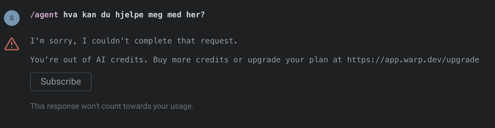

## Mac

### [[raycast|Raycast]]

For å hovedsakelig åpne opp apper på en veldig kjapp måte, men også mye, mye mer (som å fyre løs konfetti over hele skjermen, gjøre et kjapt regnestykke, konvertere valuta,  finne en gif osv.)

### [[Obsidian]]

For å ta notater, skrive, bearbeide tanker, og så mye, mye mer. Elsker hvor mye jeg kan tilpasse det. Enten til en spesifikk arbeidsflyt, eller bare endre utseendet totalt, bare fordi jeg har lyst.

### [[klisterhjerne|Readwise]]

- For å sende det jeg har markert i en podcast (gjennom Snipd), eller markert i en bok på [kindle](https://www.amazon.com/Amazon-Kindle-Ereader-Family/b?node=6669702011) inn til [[obsidian]]
	- For [å lese artikler](https://readwise.io/read) jeg har spart til seinere
	- Les [[digital klisterhjerne]] hvis du vil forstå hvordan det fungerer

### [[den-ene-funksjonen|Cleanshot]]

For å ta skjermbilder, kjappe skjermopptak, eller markere/kommentere på et bilde.

### [Arc](https://arc.net/gift/51dad61b)

Nettleseren jeg bruker, hovedsakelig på grunn av:
- Faner i vertikal visning (i stedet for horisontalt)
- "Split view" hvor du kan vise flere åpne faner ved siden av hverandre

### [Eagle](https://eagle.cool/)

For å holde orden i skjermbilder og organisere alt av visuell inspirasjon.

### [[Rocket]]

For å kjapt finne en emoji, uavhengig av hvilken meldings-app jeg er i.

### [1 Password](https://1password.com/)

Først og fremst for å holde styr på alt av passord, men også for å lage nye passord så jeg ikke bruker de samme 3-4 overalt (jeg ser på deg, svigermor 👀)

### [Beeper](https://www.beeper.com/)

Egentlig ganske magisk, for den samler så og si alle meldingstjenester i én app. Jeg har kun gratis-versjonen og har samla tekstmeldinger, messenger, whatsapp, telegram, og linkedin-meldinger (bruker ikke like ofte, men i ny og ne)

### [Bazecore](https://dygma.com/pages/raise-configuration)

For å endre ting på tastaturet mitt (Dygma Defy)

### [Tidal](https://tidal.com/)

Musikktjenesten jeg har brukt i det siste, etter..19 (?) år med Spotify.

### [Yabai](https://github.com/asmvik/yabai) 

Når det kommer til såkalt "window management" på dataen har jeg endra mye opp gjennom åra. I blant ender jeg bare opp med å bare bruke Raycast sin innebygde window management, men yabai er så smud i blant at det gir meg følelsen av at jeg *er* dataen.

### [Spark](https://sparkmailapp.com/)

Epost vil jeg helst ikke bruke mye tid på, men Spark traff sweet-spoten hvor jeg kan velge egne hurtigtaster, og gjøre det jeg kom for på en måte jeg liker. 

Testa forøvrig [Superhuman](https://superhuman.com/mail) en måned, og var frista til å gå all-in på det (er så mye hurtigtaster at det føles som *gamification* av epost), men jeg sender definitivt ikke sååå mye epost at jeg kan rettferdiggjøre å betale 300 kr i måneden for det.

### [Aquavoice](https://formulae.brew.sh/cask/aqua-voice)

Dette er den beste tale-til-tekst-tjenesten til norsk som jeg veit om. Har brukt superwhisper og whisperflow i perioder, men kommer tilbake til Aqua Voice igjen og igjen.

### [Dropover](https://dropoverapp.com/)

For de gangene du hvor du skal flytte en fil fra et sted til et annet, men hvor du kanskje må navigere deg inn i en mappe, eller på tvers av en skjerm osv.

### [Ice](https://icemenubar.app/)

Har brukt Bartender i en årrekke, for såkalt "Menu bar management", men syns det blei så buggy og "bloated" at jeg ville teste et annet alternativ. Det gjemmer altså alle ikonene på menylinja som du ikke bryr deg om i det daglige. Eller skjuler dem, og lar deg vise dem kun når du virkelig trenger dem.

### [Karabiner elements](https://karabiner-elements.pqrs.org/)

For de gangene hvor jeg på død og liv vil gjøre en tilpasning på mac-tastaturet. Som å gjøre caps-lock til en såkalt "hyper-key". Eller å endre `høyre command` til `alt`, bare fordi det føles mer naturlig.

### [Ticktick](https://ticktick.com/mac)

Når det kommer til "to do"-apper, altså "task management" så bytter jeg nesten hvert år altså, men det siste året har Ticktick funka bra. Liker godt at jeg kan tilpasse det ut i fra bruken jeg har i en gitt periode. Om det så er å knytte det sammen med Obsidian gjennom en plugin og et API, eller om det er å lage en kanban-tavle for et prosjekt jeg jobber med.

Kunne gjort det samme i Obsidian, men mentalt sett føles det ryddig å skille oppgavene jeg skal gjøre fra alt annet jeg noterer ned.

### [Screen studio](https://screen.studio/?aff=RvJK1&gad_campaignid=23654963754&gbraid=0AAAAA_cjeHcXBBxq-PzRS9ogPrezO8Hey)

For de gangene hvor jeg vil lage et skikkelig lekkert skjermopptak, som skal deles med andre, og gjerne skape litt wow-faktor i samme slengen.

### [Screen brush](https://apps.apple.com/us/app/screenbrush/id1233965871)

For å markere noe på skjermen i videomøter (eller på skjermopptak). Bruker det alt for lite. Elsker hva den lille appen der lar deg gjøre.

### [Github Desktop](https://desktop.github.com/download/)

Enkleste måten jeg veit om for å holde oversikt over kode-endringer.

### [Claude](https://claude.ai/)

Hovedsakelig er det Claude jeg bruker som min foretrukne AI-tjeneste.

### [Zed](https://zed.dev/) eller [Cursor](https://cursor.com/)

I tilfellene hvor jeg faktisk vil redigere koden selv, og ikke bare overlate rattet til Claude hele veien bruker jeg en av de to appene. Prøver å lære meg å bruke Zed, fordi det er så snappy (kjapt), men kommer tilbake til Cursor i ny og ne fordi jeg har brukt det tidligere.

### [Warp](https://www.warp.dev/) eller [Ghostty](https://ghostty.org/)

Terminalen er ikke et sted jeg føler meg spesielt trygg, så Warp har vært til stor hjelp de siste åra, hvor det har vært mulig å skrive vanlig menneskespråk og få det oversatt til f. eks git-kommandoer osv. Men det blei full stopp på all gratis-bruk etter at de ble kjøpt opp av OpenAI, om jeg ikke tar feil (se bildet under)

Derfor prøver jeg å gå over til Ghostty, som ikke bare er lynkjapt, men også hyggeligere å se på Apple sin vanlige terminal. Eneste utfordringa er at jeg ikke får den samme "hånd-holdinga" med Ghostty som jeg gjorde med Warp, men Claude har tatt over den rollen i større grad i det siste.

### [Synology photos](https://www.synology.com/en-global/dsm/feature/photos)

Til å backe opp bildene mine til NASen jeg har hjemme.

### Tjenestene jeg helst ikke skulle brukt, men må av ymse årsaker

- [Elgato Camera hub](https://edge.elgato.com/egc/macos/echm/2.3.0/CameraHub_2.3.0.7295.pkg)
	- Til [teleprompteren jeg bruker i videomøter](https://www.elgato.com/us/en/p/prompter)
		- Forbausende bra life-hack for de av vårs som har mye hjemmekontor. Da får man jo faktisk øyekontakt selv om du bruker en ekstern skjerm
- [Logi options +](https://www.logitech.com/en-us/software/logi-options-plus.html#software-download)
	- For å gjøre noen små tilpasninger på [datamusa jeg bruker – Logitech MX Vertical](https://www.logitech.com/en-us/shop/p/mx-vertical-ergonomic-mouse)

### Jobb

- Figma
- Slack
- Microsoft Teams
- Microsoft Outlook

---

## Telefon

Siden 2025 ca har jeg brukt en android-telefon som heter Jelly Star, fra Unihertz. 

Appene jeg bruker på telefonen blir jo stort sett likt som på dataen, men med noen tillegg:

- [Snipd](https://www.snipd.com/)
	- For å markere øyeblikk i en podcast og lagre dem til seinere
- [Niagara launcher](https://niagaralauncher.com/)
