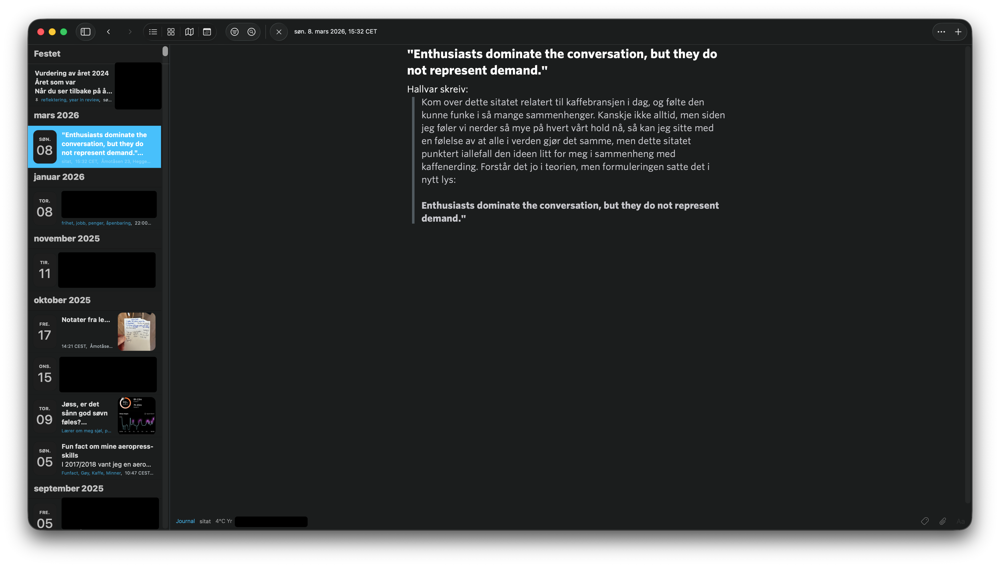
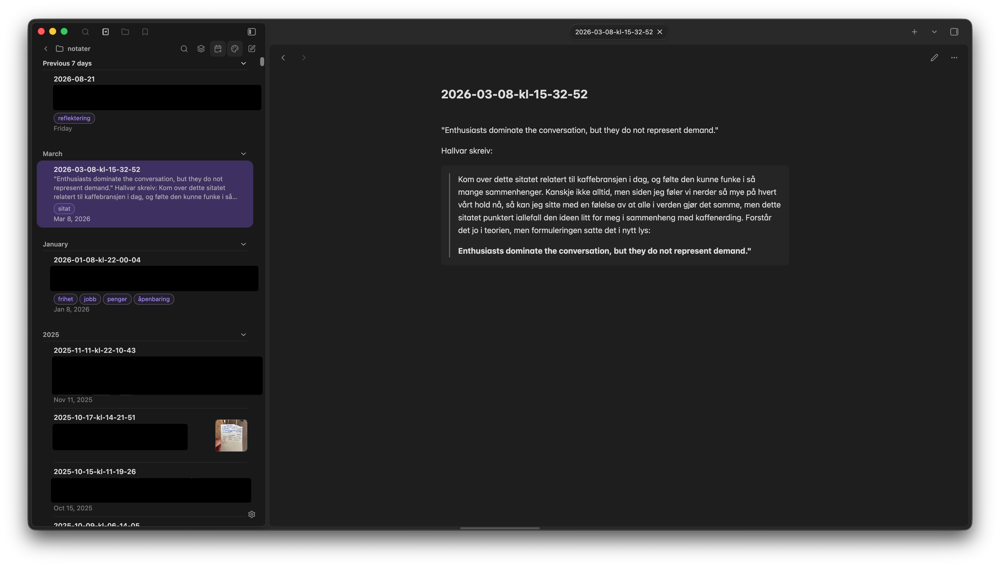
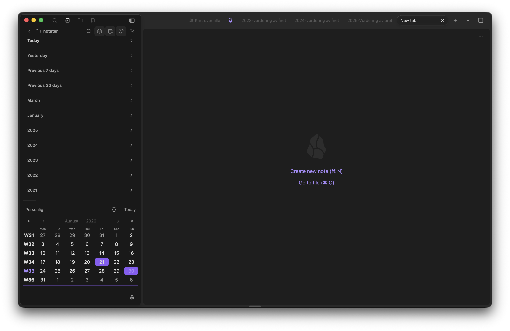
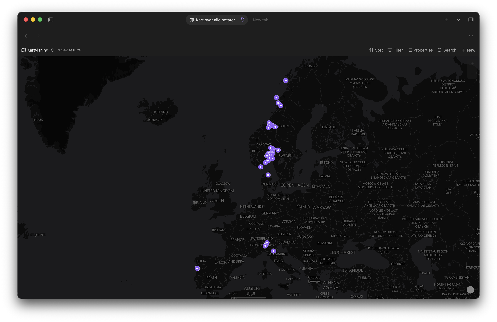

## Fra Day One til Obsidian

Ser du forskjellene på disse to bildene?

Det første bildet er fra [Day One](https://dayoneapp.com/). En app som er spissa inn mot det å skrive dagbok. Som jeg har brukt siden.. 2012 kanskje? Noe rundt der? Den koster meg 400 kr i året.

Det andre bildet der er fra [obsidian](obsidian.md). Som riktignok koster meg 900 kr i året, men den appen bruker jeg også til:
- Å skrive og publisere alt innholdet på simenskriver.no
- Notater i jobbsammenheng
- Å [samle på det jeg leser i bøker og artikler, og hører på podkaster](klisterhjerne.md)

### Hvorfor det er så kult

Det er nemlig flere ting jeg har fått til her:
1. Måten notatene vises på, med en forhåndsvisning fra de første to linjene i notatet
	1. Takket være pluginen som heter [Notebook Navigator](https://community.obsidian.md/plugins/notebook-navigator)
2. Kartvisning av alle notatene
	1. Her bruker jeg [Obsidian Bases](https://obsidian.md/help/bases) + [en plugin som heter Maps](https://community.obsidian.md/plugins/maps)
3. Kalender som viser hvilke dager i løpet av måneden jeg har skrevet noe
	1. Jeg brukte [Journals-pluginen](https://community.obsidian.md/plugins/journals), men mulig jeg går over til Notebook Navigator her og, for å forenkle oppsettet
4. Notatene grupperes i today, yesterday, previous 7 days, previous 30 days, month, year
5. At nye notater starter med en template, som fyller inn stort sett de samme detaljene jeg ville brukt i Day One (tags, dato, lokasjon)
	1. Fikk også lagd en mal for mitt årlige notat hvor jeg tar en [vurdering av året](vurdering-av-aret.md).

### Hvordan du kan gjøre det samme

I det jeg begynte å skrive det her fant jeg ut at han som har lagd Notebook Navigator-pluginen også har skrevet om nettopp det [å lage en Day One-lignende opplevelse i Obsidian](https://notebooknavigator.com/day-one/):

> **1. Export your journal from Day One**
> In Day One, export your journal as _JSON_. You get a zip file containing your entries and media.
> 
> **2. Install Obsidian and create a vault**
> 
> Download Obsidian for free from [obsidian.md](https://obsidian.md/) and create a vault for your journal, or add it to the vault you already use for notes.
> 
> **3. Import with the Day One Importer plugin**
> 
> Install the community [Day One Importer](https://github.com/MarcDonald/obsidian-day-one-importer) plugin from Community plugins, point it at your export, and it converts your entries, including inline photos, videos, tags and metadata, into Markdown notes.
> 
> **4. Set up your visual journal**
> 
> Install _Notebook Navigator_ (or use [this install link](obsidian://show-plugin?id=notebook-navigator)), enable its calendar, and configure daily notes. Days with entries show their photos right on the calendar.

