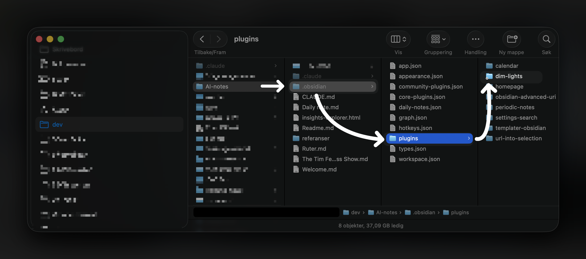

_Dette er et utkast. Sannsynligvis kommer jeg til å utdype det mer seinere, så det føles mer "ferdig", men kanskje ikke._

_Det vil si at du som leser det her rett i rss-leseren din (som jeg setter særdeles pris på forøvrig), får nok det mest uferdige resultatet av det her, og jeg anbefaler at du hopper tilbake seinere hvis du er nysgjerrig på tema._

---

Her om dagen lagde jeg min første plugin til [obsidian](obsidian.md). Og det er jeg ganske stolt over. Samtidig føles det ikke ut som *jeg* har gjort så mye, for det var jo Claude som gjorde alt. Jeg var bare konkret i hva jeg ønska meg. Og det var nøyaktig det du kan se her:

Det jeg er stolt over er at det løste nøyaktig det problemet jeg hadde. Nettopp at jeg liker å ha flere notater åpne samtidig, men jeg vil bare fokusere på ett om gangen. Og da føles det distraherende at alt får like mye fokus i grensesnittet.

Det finnes flere plugins som adresserer det her, men de jeg fant fokuserer enten på et avsnitt, eller én linje om gangen. Eller så går du i fullskjerm på det ene notatet du skal se på.

Personlig liker jeg ofte å ha to notater åpne, hvor det ene er der jeg skriver, og det andre er en referanse av noe slag. Enten det er noe jeg har lest tidligere, eller hørt i en podkast. Eller at det er bakgrunnsinfo som er relevant for det jeg skal skrive om.

Akkurat det problemet løser denne pluginen, som jeg har kalt "Dim lights", for det er i grunn det jeg vil gjøre — å dimme ned lyset på alt annet enn det jeg fokuserer på.

## Hvordan jeg lagde den

> [!todo] Utdype mer om dette punktet
> - Claude skill som jeg lagde tidligere
> - Hva den er basert på (linker?)

https://github.com/strombraaten/claude-skills/blob/main/skills/obsidian-plugin-dev/SKILL.md

## Å dele eller ikke dele

En ting som overraska meg var at jeg ikke egentlig måtte publisere pluginen til Obsidian Community for å kunne bruke den selv. 

Siden da så blei jeg såklart både rastløs og gira, og endte opp med å publisere den til Obsidian community'et. Så du kan faktisk søke den opp i Obsidian, [eller bare trykke på denne linken](https://community.obsidian.md/plugins/dim-lights), og knappen hvor det står `Add to Obsidian`.