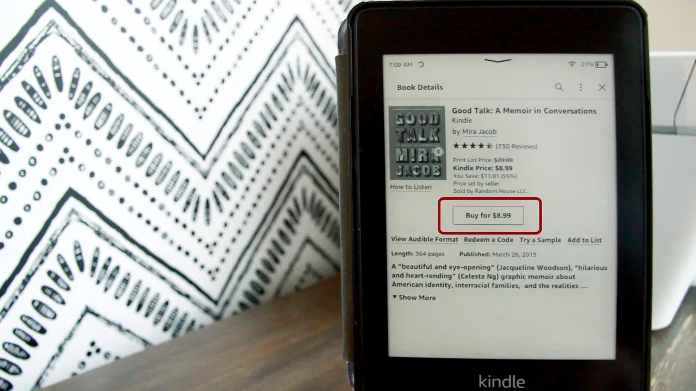

Opp gjennom årene har Amazon tatt en del valg jeg ikke liker. Som f. eks:
> Starting May 20, it (Amazon) will end support for Kindle and Kindle Fire devices released in 2012 or earlier. That means you’ll no longer be able to download new content to your e-reader via Amazon’s Kindle Store
> ([kilde](https://www.nytimes.com/wirecutter/reviews/older-kindle-support-ending/)).

Eller det at de *fjerna* muligheten til å laste ned bøkene du hadde kjøpt fra før. Så de er tilsynelatende låst til kindelen din (men ikke eeegentlig, hvis du er åpen for å [trikse litt med Calibre](https://calibre-ebook.com/)).

Dessuten trenger ikke Jeff Bezos akkurat å bli noe særlig rikere. Så da er det fristende å se etter andre muligheter. Samtidig, i stedet for å bare [kjøpe et bedre alternativ (Kobo Clara BW](https://www.clasohlson.com/no/Kobo-Clara-BW-lesebrett,-6%22-skjerm/p/39-5045-2)) ville jeg heller se nærmere på hvordan jeg kunne bruke det jeg allerede har.

Derfor triksa jeg litt med Kindelen min. En såkalt *jailbreak*, med andre ord. Det er ikke noe jeg anbefaler for alle og enhver, for [selv om DammitJeff på youtube forklarer det på en utrolig enkel måte](https://www.youtube.com/watch?v=Qtk7ERwlIAk&t=386s&pp=ygUMdHJtbmwga2luZGxl) (også i den oppdaterte videoen for [nyere jailbreaks](https://www.youtube.com/watch?v=l4ZliC82RtA&pp=ygUMdHJtbmwga2luZGxl)), så vil jeg si at det var litt flaks og tilfeldigheter at jeg faktisk kom i mål. Om du vil gi det et forsøk riktignok har du [hele oppskriften her sånn](https://kindlemodding.org/).

Men blir det noe bedre? Kort fortalt, nei. Men jeg kjenner definitivt at jeg sitter i førersete, og ikke er utsatt for hva enn Amazon skulle finne på seinere.

Dessuten, om jeg virkelig klarte å kødde det til, så er det en god unnskyldning til å bruke den som et dashboard for værmeldinga, kalender, og all slags snacks som [TRMNL byr på med sin "Bring your own device"-tilnærming](https://andrewmarder.net/trmnl/).

## Problemet derimot

Når jeg har lest ferdig en bok har jeg tidligere søkt opp en annen bok jeg har hørt om, på Kindle-butikken, hvor de har sin notoriske ett-klikks-funksjon. Og voila! Noen få minutter seinere er jeg klar til å lese en ny bok. 

Nå derimot, i dette nye livet som er mer i tråd med mine egne verdier så må jeg altså:

1. Søke opp hvor jeg finner boka til å starte med
	1. Er den på ebok.no? Hva med Norli? Kobo-butikken? Google Play-butikken?Noen andre steder jeg ikke kjenner til?
2. Kjøpe boka — Fant en bok på Google Play-butikken her om dagen, og da måtte jeg altså:
	1. Kjøpe boka fra telefonen i Google Play-butikken
		1. Finne fram passordet til Google-kontoen min i 1password, hvor jeg først må taste inn mitt supersikre passord først
		2. Velge hvilket kort jeg vil betale med
	2. Laste ned boka på dataen, fra [Google Play-biblioteket mitt](https://play.google.com/books) (som jeg ikke visste fantes)
3. Konvertere bok-formatet
	1. Åpne boka i Adobe Digital Editions, som er et program for å lese filer som er låst i et spesifikt format, knyttet til Digital Rights Management (DRM)
	2. Høyreklikke på boka, og åpne den i Finder, hvor den er lagra som .epub-fil
	3. Åpne opp Calibre
		1. Importere epub-fila der
	4. Finne en micro-usb-ledning
	5. Koble Kindlen til dataen
	6. Fra Calibre sender jeg boka til Kindle
		1. Og sier ja takk til å konvertere boka fra epub til mobi (som er Kindle sitt format)
4. Koble Kindlen fra dataen
	1. Først i Finder, deretter trekke ut ledningen
5. Åpne opp KoReader på Kindle
6. Voilá — Da var boka klar

Det store spørsmålet mitt er — Hvordan kunne dette vært lettere?
Hvis du har noen ideer vil jeg veldig gjerne høre om det.
