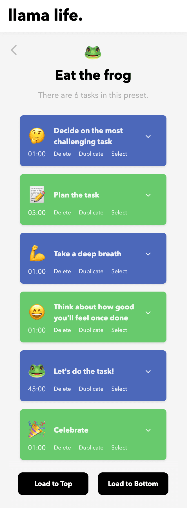

Jeg kunne egentlig tenke meg å skrive en bloggpost om det her med å beregne tid. For som en tidsoptimist for meg, eller som meg, så er det lett å ikke få med seg alle de ti minutter mellom. Store steg eller aktiviteter som kanskje veier opp til å bli selve årsaken til at jeg ofte er sen. Et eksempel på dette er når jeg ser for hvor lang tid jeg bruker på å trene før jobb når jeg har hjemmekontor. Jeg skal levere i barnehagen, jeg skal gå ned til treningsstudiet og så er det egentlig... Så skal jeg trene. Og så skal jeg gå tilbake igjen. Også skal dusje og være klar for arbeidsdagen. Men der må jeg ofte gå på en liten smell, er ved å glemme bort at jeg må faktisk skifte i gardoben før... Jeg skal trene og så må jeg skifte etter trening for å gå opp igjen. Eller jeg kan jo alltid planlegge å ta på meg av en annen så jeg ikke trenger å skifte i det hele tatt, men den der er uansett den tiden som jeg ofte glemmer å regne med da.

Et veldig godt hjelpemiddel for min del her, for å bli mer klar over tidsbruken på alle de stegene mellom. De større stegaene var det å bruke [en app som heter "Llama life"](https://llamalife.co/) og har noe med ADHD å gjøre. 

Tiltenkt folk som har ADHD som kanskje synes det kan være vanskelig å beregne tid, men mange andre som synes det er vanskelige å beregne tid også. Så med den appen jeg brukte den ikke lenger i det hele tatt, men jeg bruker den for å kartlegge hvor mye tid jeg bruker på ymse ting om morgenen. Det å bare se at jeg har satt opp tre ulike faser eller aktiviteter, og så prøver å definere hvor mye tid jeg bruker på det ulike. Og så starter den klokka for å se hvordan tid du bruker. Så har jeg iterert i løpet av en uke. I løp av noen dager kalibrerer jeg. Jeg har ganske godt hva jeg faktisk bruker tid på, og for meg er det egentlig kjempehjelpsomt, fordi det er godt mulig at vanlige folk gjør dette helt naturlig. Men jeg trengte å få det inn med teskje.
