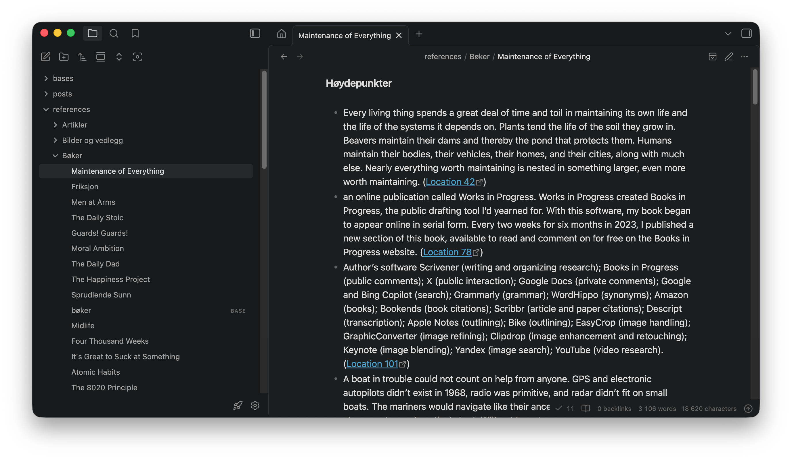
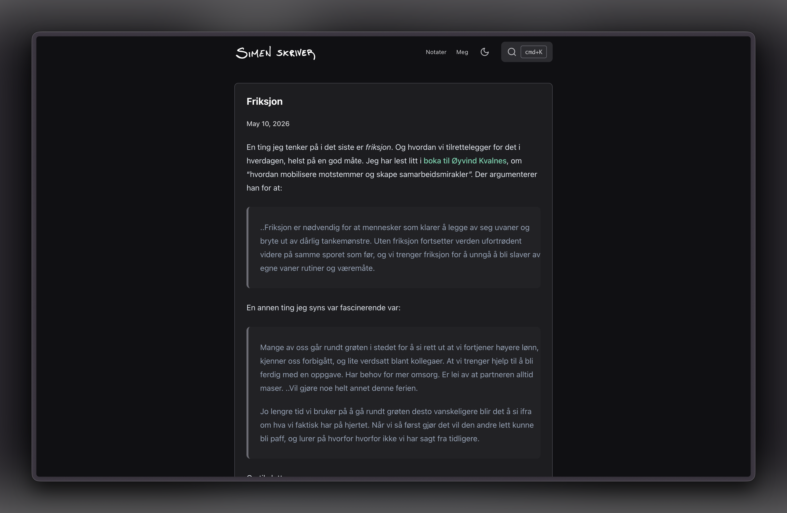
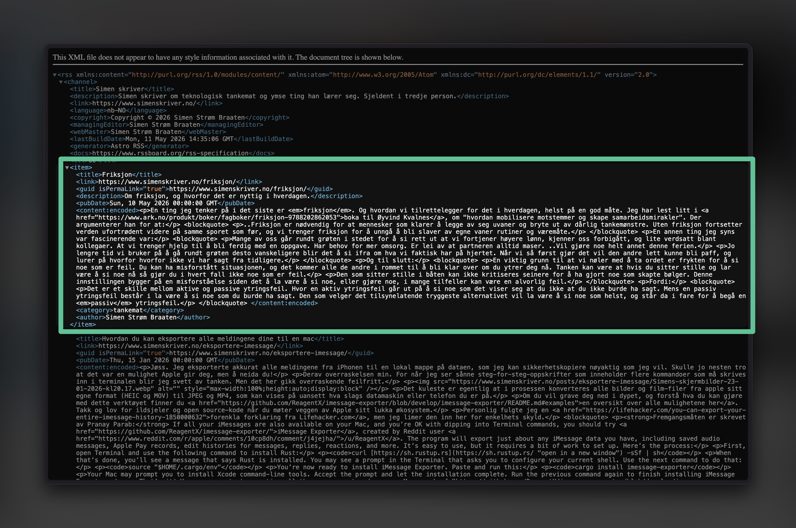

Som en selvutnevnt [dårlig utvikler](god-designer-darlig-utvikler.md) er jeg prisgitt andres arbeid, som jeg deretter kan bygge videre på for å tilpasse det sånn jeg vil ha det. Ulempa med det er at jeg ikke har forståelse for alt arbeidet som er gjort for å komme fram til det utgangspunktet. 

I blant kan arbeidet se veldig elegant ut fra utsida, men når du dykker ned i koden for å gjøre endringer ser du at det er et virrvarr av kortsiktige løsninger. Det er gjerne det som omtales som *teknisk gjeld*. Og det bar den forrige versjonen av bloggen min sterkt preg av. Til det punktet at det var kjappere (og mer motiverende) å bygge opp alt fra bunnen av, og belage meg på rammeverk som var bedre dokumentert ([Astro](https://astro.build/)), for å oppnå det jeg ville.

Simenskriver-sida for meg, handler om:
1. Legge til rette for gleden av å skrive, tenke, og forstå noe
2. Dele det som engasjerer meg med deg og andre som kan være interessert
3. Å ha en leikeplass for å utforske metoder, teknologier, eller tilnærminger som jeg er nysgjerrig på.

La vårs være ærlige her – jeg *kunne* bare satt meg ned for å skrive noe. Samtidig er jeg en person som kan bruke evigheter på å skreddersy et system rundt selve oppgava. Selv om det ville tatt meg mye mindre tid å bare.. gjøre det. Men hvor er moroa i det?

Den tilnærmingen er i aller høyeste grad gjeldende når det kommer til det nyhetsbrevet her. Eller bloggen da. Kommer an på hvor du leser det jeg skriver. Og det er *akkurat* det der – at det tilsynelatende er en forskjell mellom det du leser på bloggen og nyhetsbrevet – som jeg har tenkt på i evigheter nå. Og nå tror jeg jammen meg at jeg har funnet en løsning.

Så her er det bare å sæla på! For detta blir nerdete.

## Fugleperspektivet

For å gjøre det lettere å forstå detaljene er det nyttig å først zoome ut, for å forstå hva som skjer.

1. Jeg starter med å skrive
2. Publiserer det på bloggen – simenskriver.no
3. Sender det som nyhetsbrev på epost til fine folk som deg sjøl ([hint-hint](https://buttondown.com/simenskriver))

I bunn og grunn er det alt. Samtidig har det medført en del pirkete arbeid tidligere, som kommer i veien for selve skrivegleden. En del av prosessen er f. eks å gjøre bildene jeg har brukt klare til å publiseres på internett. Det vil si at jeg typisk sett må gjøre filstørrelsen mindre, ved å redusere både størrelsen og kvaliteten på bildet, og formatet det eksporteres i (fra jpeg til webp). Også kjent som bilde-optimalisering.

## Arbeidsflyten

[Obsidian](posts/obsidian.md) er altså der jeg skriver. Det er også der referansene mine ligger, som bare vil si at det er en mappe med tekstfiler, med høydepunkt fra bøker jeg har lest, podkaster jeg har hørt på osv. 

Om du vil forstå hvordan det funker kan du lese om det i [digital klisterhjerne](klisterhjerne.md)). Kort fortalt er det inspirasjonskildene mine, som ofte sparker i gang nye skriverier.

Når jeg da har skrevet noe ferdig, eller at det er "ferdig nok" for øyeblikket (ref [digitalt hagearbeid](digital-hage.md)), trykker jeg på en hurtigtast – `cmd+shift+s` for å være spesifikk — og dermed publiseres den fila til Github. Takket være [en plugin som heter Obsidian git](https://community.obsidian.md/plugins/obsidian-git). 

[Git](https://github.com/git-guides) gir meg også en historikk over alle endringene som er gjort. Som f. eks når jeg har klart å slette alt jeg noensinne har publisert på bloggen, uten å vite *hvordan* jeg gjorde det, og desperat ønsker å gå tilbake i tid. Da er det kjekt med git. Og du skulle tro jeg lærer fra mine feil, men akkurat den feilen der har jeg faktisk gjort flere ganger, i et evig forsøk på å gjøre arbeidsflyten enklere (og ikke *helt* forstå hva jeg driver med).

Fra Github publiseres ting automatisk til [simenskriver.no](https://www.simenskriver.no/), gjennom [Vercel](https://vercel.com/) (som tar handling når Github sier i fra), hvor nettsida mi kjører. 

Det fører også til at [rss-feeden min](https://www.simenskriver.no/rss.xml) oppdateres, som bare betyr at bloggposten i sin enkleste form er inkludert i den fila. 

For å vise deg et eksempel ser et blogginnlegg sånn her ut på nettsida:

Mens i rss-feeden ser nøyaktig det samme sånn her ut:

Og én gang i uka [sjekker Buttondown (automatisk) om det har dukket opp noe nytt](https://docs.buttondown.com/rss-to-email) i den rss-fila. Og da opprettes et utkast på nyhetsbrev i Buttondown, med kun det nye innholdet som dukka opp i rss-feeden. Ikke bare det, men de sørger også for [automatisk komprimering av bildene](https://buttondown.com/blog/images-in-newsletters) som er der.

I tillegg legges det på en avslutning for å pakke det mer inn som et nyhetsbrev. Det eneste jeg trenger å gjøre da er å se gjennom, og trykke på send, for at du skal få det servert på et sølvfat i innboksen din.

Den automatiske komprimeringa av bildene har jeg også automatisert i publiseringa til nettsida, selv om den kan nok justeres enda mer. For øyeblikket fungerer det sånn her:

1. Når sida bygges på Vercel konverteres bilder til Webp-formatet, uavhengig av hva slags format det var fra før
2. Kvaliteten på bildene senkes til 85 %, men denne kan jeg nok også senke ytterligere
3. Alle bilder som er optimalisert fra før hoppes over
4. I tillegg til at bildene "lazy-loades", som betyr at de ikke lastes inn før du skal se på dem

De to første punktene der gjøres med noe som heter Sharp og ImageMagick.

En ting som jeg ikke har på plass for øyeblikket, men som blir neste steg er å sette opp noe som kalles [srcset](https://developer.mozilla.org/en-US/docs/Web/HTML/Guides/Responsive_images). Som betyr at hvis du åpner opp simenskriver.no på telefonen din er det ikke behov å laste inn et svært bilde som er bedre egna for en 32-tommers skjerm. Derfor bør det også eksporteres ulike størrelser av bildene dine, nettopp for å tilrettelegge for det. Jeg har skjønt at jeg egentlig får det der gratis, sånn "ut av boksen", med å bruke Astro. Samtidig er det noe med måten jeg har satt opp sida mi, som gjør at jeg må [dykke dypere i det der](https://docs.astro.build/en/guides/images/), for å få det på plass.

## Konklusjon

Altså.. hvor digg er ikke det der a? Herregud. Det der har jeg brukt mer tid på enn jeg liker å innrømme. Men det er så mange steg der som jeg har gjort manuelt tidligere, så nå er det utrolig tilfredsstillende at det tas hånd om automatisk i stor grad. Også kan jeg bare fokusere på selve skrivinga.

## Bonus-info til nerdene mine der ute

Hvis du vil prøve noe lignende er det nyttig å vite at jeg måtte tilpasse rss-feeden for å hente ut riktig innhold. Når Buttondown ser etter noe nytt fra sida di så ser den spesifikt etter `content:encoded` for å hente ut selve innholdet i bloggposten. Astro, som jeg bruker for nettsida mi, gir deg ikke det ut boksen for å si det sånn. De tar heller utgangspunkt i `description`. Men etter litt fram-og-tilbake med [Claude](https://claude.ai/) så fikk jeg fiksa det. Helt spesifikt involverte det å legge til to pakker som heter `markdown-it` og `sanitize-html`. 

Når jeg uansett skulle prøve å bygge opp sida på nytt, så testa jeg å bruke [VaultCMS](https://vaultcms.org/), og [Astro Modular-designet](https://astro-modular.netlify.app/), som er lagd av samme typen – [David Kimball](https://davidvkimball.com/). Der fikk jeg veldig mye gratis, men tilpassa det også en del for å få det sånn som jeg vil ha det.

En av de tinga som jeg "fikk gratis" gjennom VaultCMS var nettopp at [syntaksen](syntaks.md) til Obsidian blir fjerna, eller oversatt til et format som Buttondown kan bruke i eposten sin. 

For å sitere Claude:

> Obsidian-spesifikk syntaks rendres ikke automatisk riktig i en e-post. Fire ting håndteres manuelt i `src/pages/rss.xml.ts`:
> 
> - `[[wikilenker]]` slås opp i en map over alle posts og gjøres til ekte `<a>`-lenker
> - `![[bilde.png]]` konverteres til absolutte ``-lenker (med full URL, ikke relativ)
> - Obsidian-callouts (`> [!NOTE]`) forenkles til vanlige blokksitater (`> `)
> - `%%kommentarer%%` fjernes

En siste ting jeg sleit med var at bilder i en epost ikke blei beskjært riktig. Men det fikk jeg fiksa med at ``-taggene i rss-feeden fikk en inline `style="max-width: 100%; height: auto; display: block;"`. Såvidt jeg skjønner gjøres det gjennom en `transformTags`-funksjon i `sanitize-html`.

Phew! Det var mye teknisk. Og det meste er i grunn mer enn jeg kan forstå, så jeg hadde jo ikke fått til alt det der uten Claude. Men det er gøy å se hva som går an nå, med litt tålmodighet og pirking.

---

## En siste ting

Ser du noe som virker unødvendig i den flyten her? Eller noe jeg burde sjekke ut for å gjøre det bedre? Gjerne si i fra, for denne arbeidsflyten er et konstant work in progress foråsirresånn.
